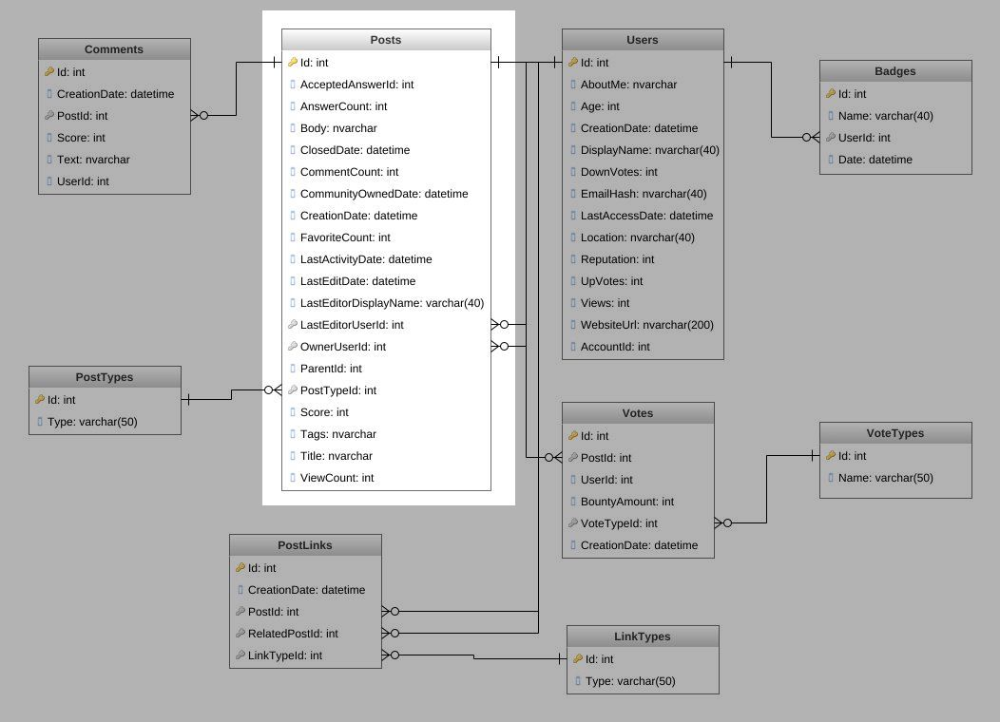
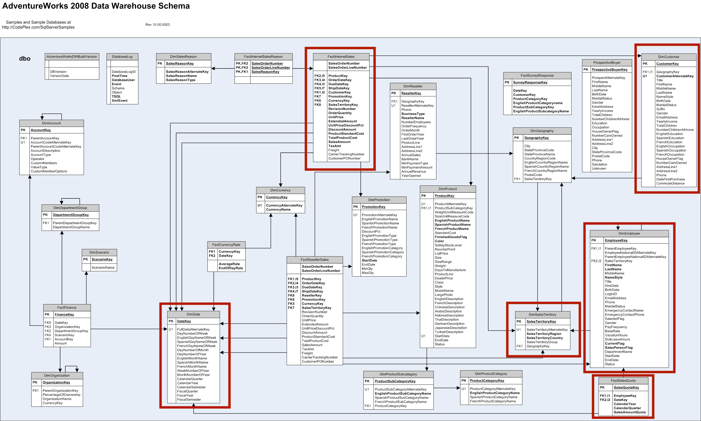

# adventureoverflow
A data pipeline using **Airflow**, **dbt** and **Great Expectations**

For this data pipeline I want to connect:	
1. Posts table from the OLTP Database of StackOverflow2010 (with data from 2008 - 2010).
Database is available for download from [Brent Ozar website](https://www.brentozar.com/archive/2015/10/how-to-download-the-stack-overflow-database-via-bittorrent/)

2. Following tables from the AdventureWorksDW database: FactInterntSales, DimSalesTerritory, DimCustomer, DimDate, FactSalesQuota, DimEmployee

The RDBMS for both databases is ServerSQL.

3. Data from the [Calendarific API](https://calendarific.com/) to include information about holidays into the new database. This information will go into a table called DimDateHoliday

Schemas of the AdventureWorks and StackOverflow with the tables to be taken out of these databaes can be found below.

**StackOverflow2010**

 

**AdventureWorksDW**

**AdventuresOverflow**

Schema of the new AdventuresOverflow database:

 
